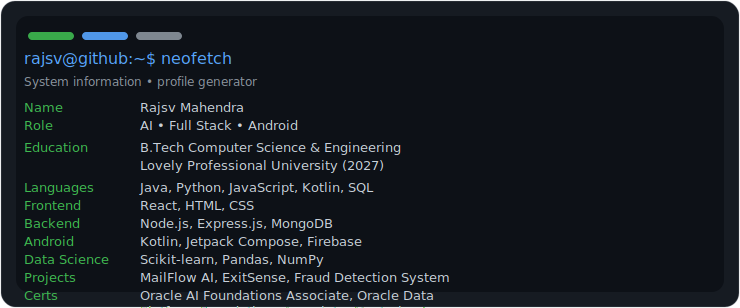

<div align="center">

# Rajsv Mahendra

### Building thoughtful AI, full-stack, and Android experiences

<p>
  <a href="https://github.com/rajsvmahendra">
    
  </a>
</p>

</div>

This repository powers a polished GitHub profile experience with generated SVG assets, a terminal-inspired profile card, and an automated refresh pipeline. It keeps the existing modular architecture intact while improving the visual quality of every output.

---

## 📈 Contribution Activity

<p align="center">
  
</p>

---

## 💻 Terminal Profile

<table>
  <tr>
    <td width="34%" align="center">
      
    </td>
    <td width="66%">
      
    </td>
  </tr>
</table>

---

## ✨ What this project does

- Generates a portrait-style ASCII preview and SVG rendering
- Builds a terminal-inspired info card with automatic text wrapping
- Produces a GitHub-style contribution heatmap
- Publishes the output assets for use in a profile README
- Supports daily automated refreshes through GitHub Actions

## 🧱 Project structure

- [build.py](build.py) – runs the complete generation pipeline
- [scripts/](scripts/) – modular generators for photo prep, ASCII art, info cards, and contribution graphs
- [config/](config/) – profile and theme customization files
- [assets/generated/](assets/generated/) – generated SVG and JSON assets
- [.github/workflows/update.yml](.github/workflows/update.yml) – scheduled automation workflow

## 🚀 Getting started

1. Create or activate a Python environment.
2. Install dependencies:

```bash
pip install -r scripts/requirements.txt
```

3. Generate the assets:

```bash
python build.py
```

## ⚙️ Customization

Edit the YAML files in [config/](config/) to personalize the output:

- [config/profile.yaml](config/profile.yaml) – name, role, education, projects, and stack
- [config/theme.yaml](config/theme.yaml) – colors, spacing, and animation settings

You can also replace [assets/profile.jpg](assets/profile.jpg) with your own portrait image to change the ASCII render and profile visuals.

## 🤖 Automation

A GitHub Actions workflow is configured in [.github/workflows/update.yml](.github/workflows/update.yml). It will:

- install dependencies
- run the asset generation pipeline
- commit updated generated files when changes are detected
- run daily and also support manual execution

## 🛠 Development notes

The implementation stays intentionally modular so each stage of the pipeline can be updated independently. The scripts remain script-based and dependency-light, which makes them easy to run locally or in CI.
